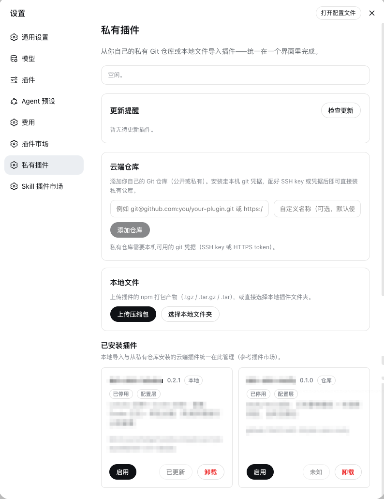

# dsh-private-plugins

私有插件：在 **设置** 侧栏新增独立的「私有插件」入口（与「插件市场」并列），把 **云端 Git 仓库安装插件** 与 **本地插件导入** 放在同一个界面。

> 社区维护的 DSH Plugin，与 DeepSeek AI 无隶属关系，也不代表 DeepSeek AI 官方。

[](https://dsh-plugin.org/plugins/your-owner/your-plugin-slug)



- 导入方式：**云端仓库** 与 **本地文件** 分别位于独立卡片——可添加公开/私有 Git 仓库（可选自定义名称）、上传 `.tgz / .tar.gz / .tar` 压缩包，或选择本地插件文件夹。
- 已安装插件：**卡片式管理列表**（参考插件市场）——本地导入与云端仓库插件统一在这里展示，每张卡片提供：
  - **启用 / 停用**：写入 profile 的 `cordis.patch.yml` 补丁层，重启后生效；
  - **安装**：尚未安装的云端仓库可直接安装；
  - **待更新 / 已更新 / 未知**：更新状态显示在对应插件卡片；
  - **卸载**。
- 所有变更通过 `dsh plugin --profile <p> add|remove <spec>` 执行，与 DSH Desktop / dsh-market 同一安装链路；完成后提示重启 Harness 生效（桌面版提供一键重启按钮）。

## 安装

### 一键脚本（推荐）

无需克隆仓库，直接从 GitHub 安装；脚本会识别 Desktop 实际使用的 `DSH_HOME`、`web` / `desktop` profile 和匹配的 pnpm 主版本：

```sh
curl -fsSL https://raw.githubusercontent.com/YINGCHAO-98/dsh-private-plugins/main/scripts/install.sh | bash -s -- --remote
```

已经下载本仓库时，也可以安装当前本地代码：

```sh
./dsh-private-plugins/scripts/install.sh            # 有多个 profile 时交互选择
./dsh-private-plugins/scripts/install.sh --all      # 装进所有检测到的 profile
./dsh-private-plugins/scripts/install.sh --check    # 只打印检测结果
./dsh-private-plugins/scripts/install.sh --reinstall   # 已安装则先移除再重装
./dsh-private-plugins/scripts/install.sh --home <DSH_HOME>   # 指定 DSH_HOME
./dsh-private-plugins/scripts/install.sh --profile <name>   # 指定 profile（如 desktop / web）
```

脚本会自动探测 dsh CLI，并读取 DSH Desktop 实际存在的 profile（例如 `desktop` 或 `web`）。它优先使用 Desktop 自带的 pnpm，避免全局 pnpm 主版本不同导致 `ERR_PNPM_UNEXPECTED_STORE`。也可用 `--profile desktop` 或 `--profile web` 显式指定。macOS 上会探测正式版、dev 版和 `~/.dsh`；Windows 请用 `--home` 指定 DSH_HOME。

### 手动命令

所有用户都可以直接复制下面的命令，从 GitHub 安装本插件（公开仓库无需填写 Token）：

```sh
# 仅当已确认 DSH_HOME、profile 和 pnpm 版本匹配时使用
dsh plugin --profile web add "git+https://github.com/YINGCHAO-98/dsh-private-plugins.git"

# 独立 CLI 使用 ~/.dsh/profiles/desktop 时
dsh plugin --profile desktop add "git+https://github.com/YINGCHAO-98/dsh-private-plugins.git"

# 在本项目根目录执行：安装当前本地代码（macOS Desktop 开发调试用）
DSH_HOME="$HOME/Library/Application Support/dsh-desktop/harness" \
  dsh plugin --profile web add "$PWD"
```

手动命令要求当前终端已经使用正确的 `DSH_HOME` 和 pnpm 主版本，因此普通用户应优先使用上面的一键脚本。安装完成后，从菜单 **Harness → 重启 Harness**，然后打开 **设置 → 私有插件** 即可使用；安装了 `dsh-market` 时，该入口紧随「插件市场」。

## 私有仓库支持

界面支持以下地址写法（添加时自动归一化为 pnpm 的 git spec）：

| 输入 | 归一化结果 |
|---|---|
| `https://github.com/you/repo` | `git+https://github.com/you/repo.git` |
| `git@github.com:you/repo.git` | `git+ssh://git@github.com/you/repo.git` |
| `github:you/repo` | `github:you/repo`（原样，pnpm 简写） |
| `git+https://…` / `git+ssh://…` | 原样 |
| `git+file:///…` | 原样（本地 git 仓库，用于测试） |

- 分支/标签：在地址后追加 `#分支名`（如 `git+https://github.com/you/repo.git#main`）。
- 私有仓库凭据：安装走本机 `git`，与你在终端 `git clone` 使用同一套凭据——SSH key（`git@…` / `git+ssh://`）、HTTPS token（`https://`，配合 credential helper）或全局 git 配置。
- 仓库列表保存在 `<profile>/.dsh-private-plugins/repos.json`，重启后仍在。

## 更新提醒

打开「私有插件」页面会自动检查由本页管理的插件更新（结果缓存 1 小时，可点「检查更新」强制刷新），有新版时对应插件行直接显示「更新」按钮，点击即更新为最新版本；插件市场安装的项目仅在「插件市场」内显示：

- **npm 来源**（registry 安装）：查询本机配置的 npm registry（`npm_config_registry`，默认 npmjs.org）的 `dist-tags.latest`，与已装版本比较。
- **git 来源**（私有仓库，含 `github:owner/repo`）：对比 `pnpm-lock.yaml` 里记录的已解析 commit 与 `git ls-remote` 的远端 HEAD/分支 commit。私有仓库若本机凭据不可用，显示「更新状态未知」，**不会误报**。
- **本地来源**（`file:` / `link:`）：可识别 Git 工作区；`link:` 源码目录为实时链接，已直接生效。非 Git 本地来源显示「未知」。
- 更新状态显示在各自插件卡片；更新完成后提示重启 Harness（桌面版可一键重启）。

## 安全说明

- 所有会改动 profile 的 HTTP 路由只接受 **回环 + 同源** 请求（`isTrustedRequest`）。
- 云端安装 spec 有白名单校验（npm 名/github: 源），上传文件名被清洗，路径导入要求绝对路径且拒绝指向 profile 自身。
- 本地安装会执行 pnpm/`dsh plugin`，属于特权操作：只导入可信来源的插件（插件的 `cordis.patch.yml` / `client.js` 会获得与主进程同等的执行权限）。

## 目录结构

```text
dsh-private-plugins/
├── package.json          # dsh.bundle（配置层）+ dsh.client（浏览器端入口）
├── cordis.patch.yml      # 把插件行插入配置树
├── lib/                  # 宿主端（Node）
│   ├── index.js          # apply(ctx) + HTTP 路由 + 操作编排
│   ├── profile.js        # profile 解析与已安装清单
│   ├── dsh.js            # 重新调用 dsh CLI（超时/进程树清理）
│   ├── repos.js          # 私有仓库地址归一化/校验 + repos.json 持久化
│   ├── toggle.js         # 插件启用/停用（写入 profile 的 cordis.patch.yml 补丁层）
│   └── validate.js       # spec/文件名/路径校验 + HTTP 工具
├── client/client.js      # 浏览器端 UI（零构建 ModuleLoader 格式）
├── scripts/install.sh    # 一键安装/重装脚本（自动探测 profile 与 dsh CLI）
└── test/                 # node:test 单元测试
```

## 开发与测试

```sh
node --test test/unit.test.mjs
```

浏览器端 `client.js` 是手写的 `window.__ModuleLoader__.load({ id, factory })` 格式，无需构建；宿主端为纯 ESM、零运行时依赖。
